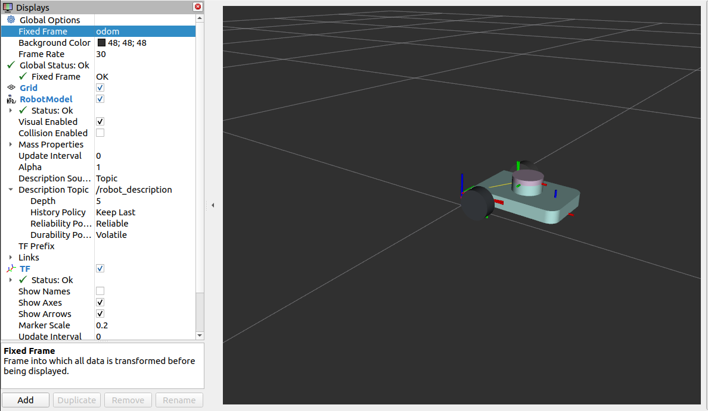
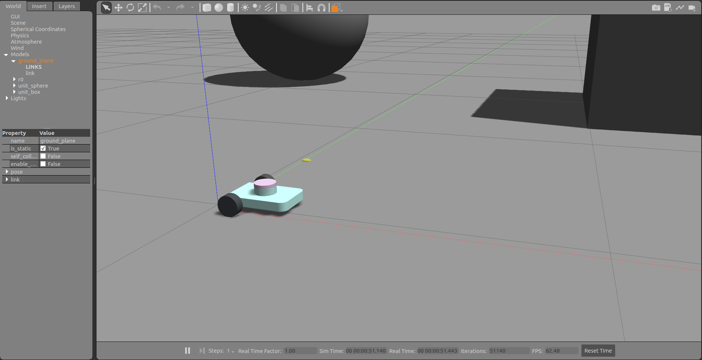
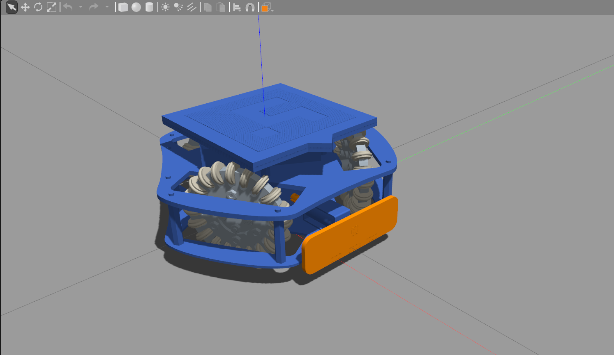
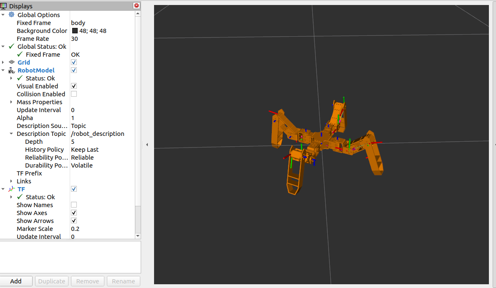

<p align="center">
  
</p>

<h1 align="center">meshflow</h1>

<p align="center">
  <strong>Onshape → ROS&nbsp;2</strong> simulation package generator.
</p>

<p align="center">
  Generate complete ROS 2 robot description packages directly from an Onshape assembly —
  including URDF, xacro, Gazebo integration, RViz configuration, and launch files.
</p>

<p align="center">


</p>

**Full ROS 2 simulation package, generated directly from your Onshape assembly.**  
Supports wheeled robots (2/3/4-wheel) · legged robots *(beta)* · arm robots *(beta)*

meshflow takes an Onshape assembly URL and outputs a complete, simulation-ready ROS 2 description package: URDF, xacro, Gazebo plugins, and launch files. Robot type is inferred entirely from URDF geometry; wheeled robots get drive plugins and odometry, legged and arm robots get ros2_control wired up automatically. No joint or link naming conventions required.

---

## Samples

**My bot** — built from scratch in Onshape:

| RViz | Gazebo |
|:---:|:---:|
|  |  |

**Public Onshape assemblies** rendered with meshflow:

| RViz | Gazebo |
|:---:|:---:|
|  |  |

| RViz | Gazebo |
|:---:|:---:|
|  |  |

---

## What you get

Given one Onshape URL and a robot name, meshflow generates a fully structured ROS 2 package:

```
<robot>_description/
├── launch/
│   ├── display.launch.py      # RViz preview — no colcon needed
│   └── gazebo.launch.py       # full Gazebo Classic 11 simulation
├── models/
│   ├── urdf/
│   │   ├── <robot>.urdf       # flat URDF (used by display.launch)
│   │   └── <robot>.urdf.xacro # xacro with Gazebo plugins wired in
│   └── meshes/                # STL files pulled from Onshape
├── gazebo/
│   └── <robot>.gazebo         # drive + sensor + friction plugins
├── config/                    # legged / arm only
│   └── controllers.yaml
├── media/
│   └── materials/scripts/
│       └── <robot>.material   # OGRE per-link colors for Gazebo Classic
└── rviz/
    └── robot.rviz             # pre-configured RViz layout
```

Plugins generated per detected geometry:

| Robot kind | Detected when | Gazebo plugin |
|---|---|---|
| Differential drive | 2–3 `continuous` wheels, axis ≈ Y | `libgazebo_ros_diff_drive.so` |
| Skid steer | 4 `continuous` wheels, axis ≈ Y | `libgazebo_ros_skid_steer_drive.so` |
| Legged *(beta)* | 3+ top-level branches with movable joints, no drive wheels | `libgazebo_ros2_control.so` (if installed) |
| Arm *(beta)* | 1–2 top-level movable branches, no drive wheels | `libgazebo_ros2_control.so` (if installed) |
| Lidar (revolute) | `revolute` joint, axis not Y, z > 5 cm | `libgazebo_ros_ray_sensor.so` |
| Camera (fixed) | `fixed` leaf, elongated box geometry or `cam`/`camera` in name | `libgazebo_ros_camera.so` |
| Depth camera | `fixed` leaf, box ~6 cm thin × ≥ 8 cm wide, or `depth`/`realsense` in name | `libgazebo_ros_depth_camera.so` |
| IMU | `fixed` leaf, near-cubic geometry < 4 cm, or `imu`/`gyro` in name | `libgazebo_ros_imu_sensor.so` |

Per-link OGRE colors are extracted from URDF `<material>` tags and written to `media/materials/scripts/<robot>.material`.

> **Note:** Legged and arm robot support is in beta. The robot will spawn and render correctly in Gazebo and RViz; controller integration (`joint_trajectory_controller`) requires `ros-humble-ros2-control` and is actively being tested across robot configurations.

---

## Requirements

| Dependency | Version | Notes |
|---|---|---|
| Python | 3.10+ | |
| [uv](https://docs.astral.sh/uv/) | any | package manager (auto-installed by `install.sh`) |
| ROS 2 | Humble or later | must be sourced before launching |
| Gazebo Classic | 11 | `gazebo_ros` bridge |
| `ros-$ROS_DISTRO-gazebo-ros-pkgs` | — | Gazebo ↔ ROS bridge |
| `ros-$ROS_DISTRO-robot-state-publisher` | — | TF broadcast |
| `ros-$ROS_DISTRO-joint-state-publisher-gui` | — | manual joint control in RViz |
| `ros-$ROS_DISTRO-xacro` | — | xacro processing |
| `ros-$ROS_DISTRO-ros2-control` | optional | legged/arm controller spawners |
| `ros-$ROS_DISTRO-gazebo-ros2-control` | optional | Gazebo ros2_control plugin |

Install the ROS 2 packages (replace `humble` with your distro):

```bash
sudo apt install \
  ros-humble-gazebo-ros-pkgs \
  ros-humble-robot-state-publisher \
  ros-humble-joint-state-publisher-gui \
  ros-humble-xacro
```

For legged / arm robots, also install:

```bash
sudo apt install \
  ros-humble-ros2-control \
  ros-humble-gazebo-ros2-control
```

If these are not installed, meshflow still generates the package and the robot spawns in Gazebo; controller spawners are skipped with an install hint printed to stderr.

---

## Installation

```bash
git clone https://github.com/prtmxio/meshflow
cd meshflow
bash install.sh
```

The script:
1. Checks Python 3.10+
2. Installs `uv` if not present
3. Installs all Python dependencies (`onshape-to-robot`, `numpy`, `trimesh`, `python-dotenv`)
4. Installs the `meshflow` CLI globally via `uv tool install` → available from anywhere as `meshflow`

If `meshflow` is not found after install, add `~/.local/bin` to your PATH:

```bash
echo 'export PATH="$HOME/.local/bin:$PATH"' >> ~/.zshrc   # or ~/.bashrc
source ~/.zshrc
```

---

## Setup: Onshape API keys

meshflow reads your CAD via the Onshape REST API. You need a free API key pair.

**Get your keys:**
1. Log in to [Onshape](https://cad.onshape.com)
2. Click your profile avatar (top right) → **My Account**
3. Go to the **Developer** tab
4. Click the **API Keys** link
5. Click **Create new API key**
6. Copy **both** the Access Key and Secret Key before closing; the secret is only shown once

**Save them:**

```bash
meshflow init
```

This creates `~/.config/meshflow/.env` and opens it in your `$EDITOR`. Fill in:

```
ONSHAPE_ACCESS_KEY=<your access key>
ONSHAPE_SECRET_KEY=<your secret key>
```

Save and close. Run `meshflow init` again at any time to edit the keys.

---

## Usage

```bash
meshflow
```

You will be prompted for:

| Prompt | Example |
|---|---|
| Onshape URL | `https://cad.onshape.com/documents/abc.../w/def.../e/ghi...` |
| Robot name | `my_robot` |
| Assembly name | `asm` (the Onshape assembly tab name) |
| Output format | `urdf` (also: `sdf`, `mujoco`) |

The generated package lands in `output/<robot>_description/`.

---

## Run in Gazebo

**Step 1: copy the package into your ROS 2 workspace:**

```bash
cp -r output/<robot>_description ~/ros2_ws/src/
```

**Step 2: build:**

```bash
cd ~/ros2_ws
colcon build --packages-select <robot>_description
source install/setup.zsh   # or setup.bash
```

**Step 3: launch:**

```bash
ros2 launch <robot>_description gazebo.launch.py
```

Gazebo, RViz, and the robot spawn automatically. To drive the robot:

```bash
ros2 run teleop_twist_keyboard teleop_twist_keyboard
```

To verify the lidar:

```bash
ros2 topic hz /scan        # expect ~20 Hz
```

---

## Quick preview (no colcon)

To inspect the URDF in RViz without building a workspace:

```bash
cd output/<robot>_description/launch
ros2 launch display.launch.py
```

---

## Reference

```
meshflow --help       show usage summary
meshflow init         create/edit API key config
meshflow              run the converter
```

---

## Architecture

| Module | Role |
|---|---|
| `cli.py` | Entry point; handles prompts and subcommand dispatch |
| `onshape.py` | API auth, URL parsing, `onshape-to-robot` subprocess |
| `restructure.py` | File layout, `package://` URI patching, boilerplate |
| `detector.py` | `KinematicDAG` and `URDFTraits`; geometry-only robot classification |
| `generator.py` | `.gazebo` and xacro generation from `URDFTraits` |
| `templates.py` | All string templates as named constants |

### How geometry detection works

`KinematicDAG` parses the URDF `<joint>` tree and computes global 4×4 transforms for every link. `URDFTraits` then classifies each node using spatial and kinematic properties:

**Robot kind** (checked in order):

| Robot kind | Rule |
|---|---|
| Wheeled | 2+ `continuous` joints, axis ≈ Y, z_min < 20 cm |
| Legged | 3+ top-level branches each containing at least one movable joint |
| Arm | 1–2 top-level movable branches, no drive wheels |

**Node classification:**

| Classification | Rule |
|---|---|
| Drive wheel | `continuous` joint, axis ≈ Y-axis, z_min < 20 cm |
| Passive contact (caster) | `fixed` joint, z_min < 1 cm |
| Revolute sensor | `revolute` joint, axis not Y, z_min > 5 cm |
| Fixed sensor | `fixed` leaf node, z_min > 5 cm, no co-located drive wheel sibling |

Sensor type falls back to **link/joint name keywords** (`lidar`, `cam`, `imu`, `depth`, `realsense`, …) when mesh geometry is not available (zero-volume or massless visual-only links).

Wheel diameter and separation are measured directly from mesh geometry via `trimesh`, so plugin values are physically accurate without any manual input.

---

## Tests

```bash
uv run pytest tests/ -v
```
